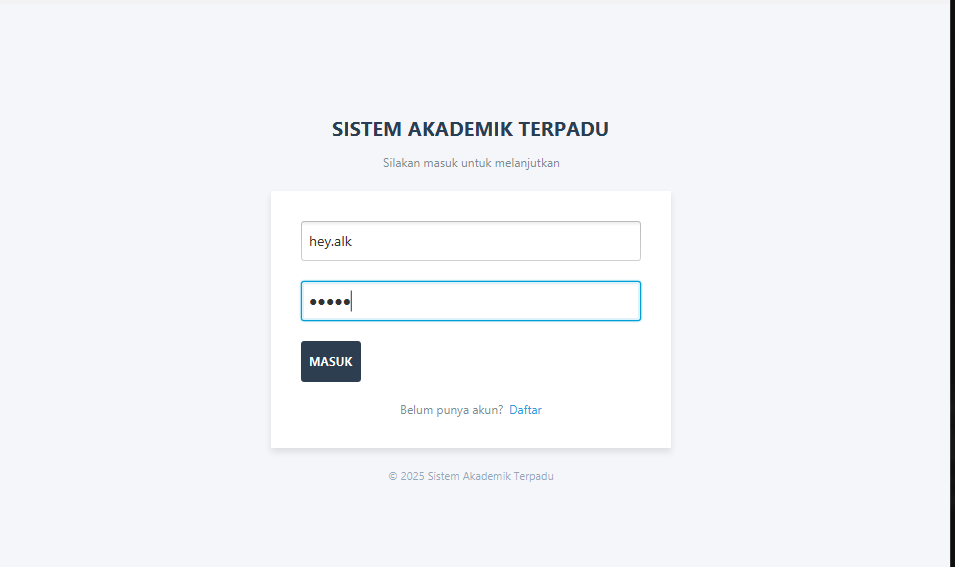
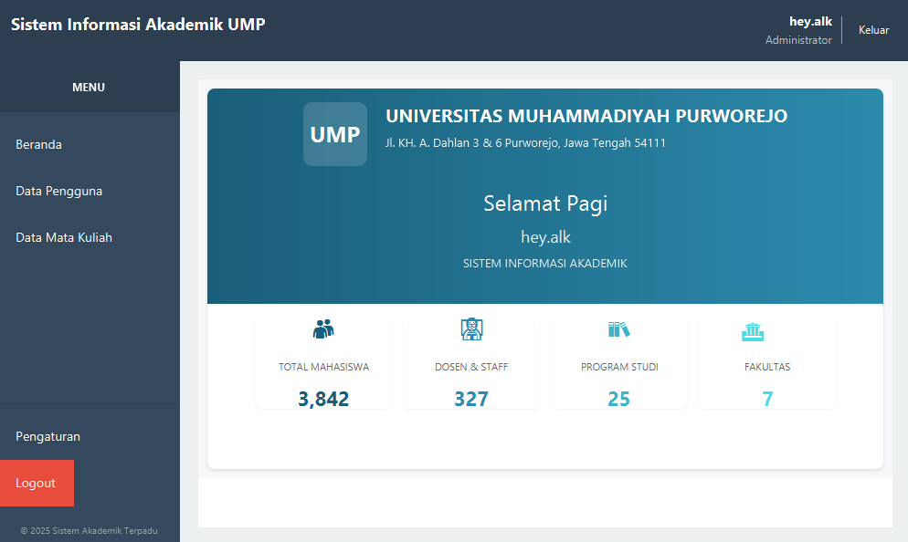
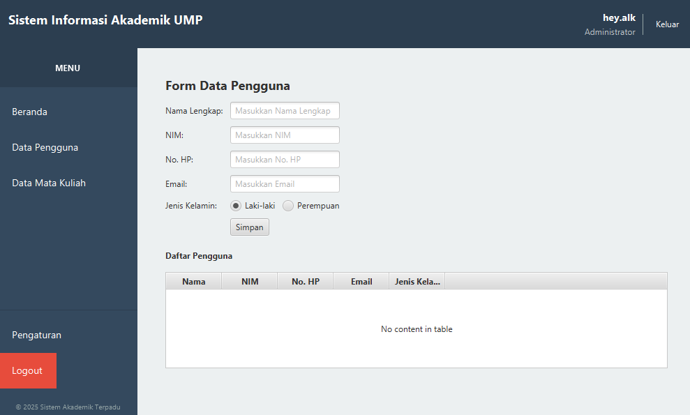
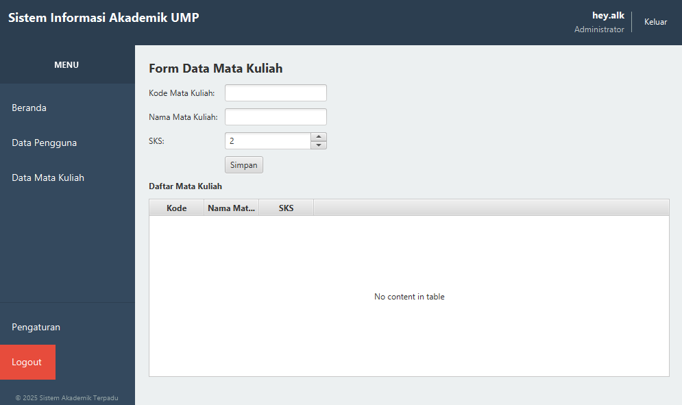

# 📊 Sistem Manajemen Proyek Java


Sistem manajemen proyek berbasis Java dengan fitur autentikasi pengguna, manajemen file, dan manajemen data yang komprehensif.

## 📸 Tampilan Aplikasi

Berikut adalah beberapa tangkapan layar dari aplikasi:

### 1. Halaman Login

*Tampilan halaman login untuk mengakses sistem*

### 2. Beranda

*Tampilan dashboard utama setelah login*

### 3. Manajemen Data Pengguna

*Halaman untuk mengelola data pengguna sistem*

### 4. Manajemen Mata Kuliah

*Halaman untuk mengelola data mata kuliah*

> 💡 Pastikan untuk menambahkan file-file screenshot di atas ke dalam folder `screenshots/`.

## ✨ Fitur Utama

- 🔐 **Sistem Autentikasi Aman**
  - Pendaftaran dan login pengguna
  - Enkripsi kata sandi
  - Manajemen sesi

- 📝 **Manajemen File**
  - Membuat, membaca, memperbarui, dan menghapus file
  - Pengorganisasian file
  - Navigasi file yang mudah

- 🖥️ **Antarmuka Pengguna**
  - Dashboard intuitif
  - Desain responsif
  - Tampilan yang bersih dan modern

- 🔄 **Manajemen Data**
  - Operasi CRUD (Buat, Baca, Perbarui, Hapus)
  - Validasi data
  - Penanganan data yang efisien

## 🚀 Memulai

### Persyaratan Sistem

- Java JDK 17 atau lebih tinggi
- JavaFX SDK (untuk komponen antarmuka)
- Maven (untuk manajemen dependensi)

### Instalasi

1. Clone repositori ini:
   ```bash
   git clone https://github.com/username-anda/nama-repositori.git
   cd nama-repositori
   ```

2. Build proyek:
   ```bash
   mvn clean install
   ```

3. Jalankan aplikasi:
   ```bash
   mvn javafx:run
   ```

## 📂 Struktur Proyek

```
src/
├── main/
│   ├── java/
│   │   ├── controller/     # Kontroller aplikasi
│   │   ├── model/         # Model data
│   │   ├── view/          # Tampilan FXML
│   │   └── Main.java      # Titik masuk aplikasi
│   └── resources/         # File sumber daya
└── test/                  # File pengujian
```

## 🛠️ Dibangun Menggunakan

- [JavaFX](https://openjfx.io/) - Untuk antarmuka pengguna grafis
- [Maven](https://maven.apache.org/) - Manajemen Dependensi
- [Scene Builder](https://gluonhq.com/products/scene-builder/) - Untuk mendesain tata letak FXML

## 📝 Lisensi

Proyek ini dilisensikan di bawah Lisensi MIT - lihat file [LICENSE](LICENSE) untuk detail lebih lanjut.

## 👨‍💻 Pembuat

- **hey.alk** - [Profil GitHub](https://github.com/hey-alk)

## 🙏 Ucapan Terima Kasih

- Terima kasih kepada semua yang kodenya digunakan
- Sumber inspirasi
- Referensi terkait

---

<p align="center">
  Dibuat dengan ❤️ oleh <a href="https://github.com/hey-alk">hey.alk</a>
</p>

<p align="center">
  Hak Cipta © 2025 hey.alk - Semua Hak Dilindungi
</p>
